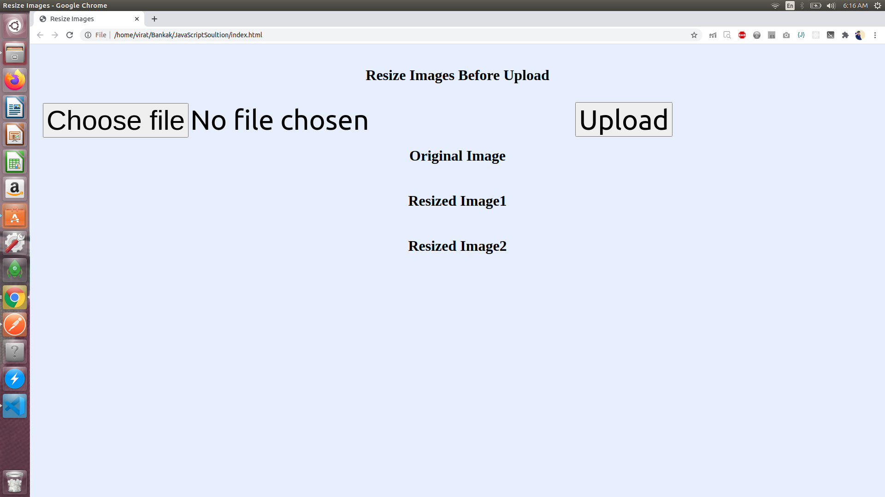
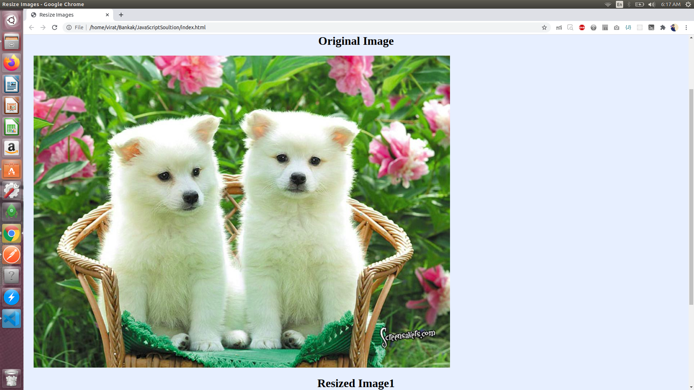
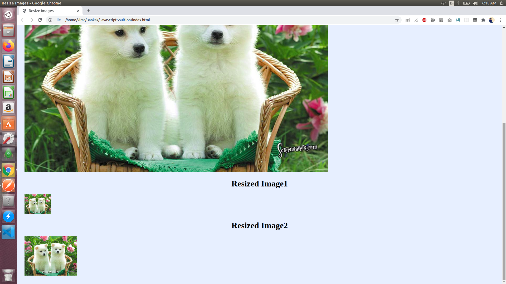

# Bankak
Compress | Resize | Images before uploading

# Image-Compression Techniques | RESEARCH WORK
  - To compress images and, consequently, reduce their sizes, you apply a transformation technique that removes the image parts with a negligible or low visual effect on the display quality. Image compression can be lossless or lossy.
  1. Lossless Compression :
    - Lossless compression of images results in no loss of pixel data, significantly reducing their sizes with no quality compromise in the display. The examples below demonstrate lossless image-compression in play.
       - The original, uncompressed picture with a size of 2.58 MB
       - The compressed version with a size of 918 KB
  2. Lossy Compression :
    - As its name implies, lossy compression causes loss of pixel data. That’s a result of the removal of certain image parts.

# Lossless Compression Vs Lossy Compression :
    1. Lossless Compression
      - A lossless attribute for images that are of the GIF, BMP, RAW, or PNG file type.
      - An outstanding display.
      - Possibly less reduction in file size than that engendered through lossy compression.
    2. Lossy Compression
      - A lossy attribute for images that are of the JPEG or GIF file type.
      - A greatly reduced file size.
      - Irreversible images: once you go lossy, you’re beyond the point of no return.
      - Possible degradation of image quality in case of application of extreme parameters.
      
# Benefits of Image Compression :
  - Fast Page-Loading Speed
  - Faster Backups
  - Lower Bandwidth
  - Less Storage Space
  
# Optimize images for performance
  - When it comes to optimizing images for performance there are a lot of things you can do, such as scaling, compression, using responsive images, serving from a CDN, and choosing the right file format.
  1. Image scaling
  2. Image compression
  3. Responsive images
    - Responsive image techniques, such as the srcset, sizes, and media HTML attributes, allow different scaled images to be delivered based on the size and resolution of the accessing device. This allows you to further optimize your image delivery to improve the overall performance of your website or application.
  4. Image CDN
    - Using a content delivery network like KeyCDN, or what we also call an image CDN, can be one of the easiest and fastest ways to speed up the delivery of your images. The main reason is because it decreases the latency to the user where they are located by serving your images from a POP physically closest to them. It also allows for additional control over the caching of your images as well as hotlink protection.
  5. File formats - PNG, JPEG, WebP, and SVG
    - One of the final ways you can optimize images for web performance is to have a good strategy for the file formats you use. PNG and JPEG are the most commonly used image file formats on the web. However, there are two other formats that you should also be considering, and that is WebP and SVG. These are by far the smallest in size and can do wonders to reduce your total web page size.

# Compress images on client side before uploading 
  - BlobBuilder is a handy API for creating Blobs (or Files) in JavaScript. It's been around since Chrome 8, FF 6, and IE 10 but has never shipped in Safari,...and likely never will. Recent spec changes to the File API include a new constructor for Blob, which essentially makes BlobBuilder irrelevant. In fact, Safari nightlies have already disabled it and Chrome will start to warn you in the console very soon.
# JavaScript Solution :
- https://github.com/Viratsoam/Bankak/tree/main/JavaScriptSoultion
 - First Page | Preview
 
 - Second Page | preview
 
 - Third Page | Preview
 
      
 # Note:-
  - Here we get 2 compressed image file and 1 original image file.
  - I have just passed the base64 url with src which we can used to store on cloud and save it in our database as per our as per your convenience.
  
 # Node.js Solution
 - Requirements
    1. "express": "^4.17.1"
    2. "multer": "^1.4.2",
    3. "sharp": "^0.26.2"
 - How to Run
    1. clone : https://github.com/Viratsoam/Bankak/tree/main/NodejsSolution
    2. cd NodejsSolution
    3. npm install
    4. npm start | you may need to install nodemone
 - API 
    1. POST : http://localhost:4000/upload
      - formdata :- key:profile and type is file valu: image.jpg
      # output :
        - { "success": 1,"profile_url": "http://localhost:4000/profile/profile_1603935478058.jpg"}
    2. Check Validation POST : http://localhost:4000/upload
       # output: 
        - { "success": 0,"Error": "file to large"}
       
Suggestions always accepted !!
  
 
